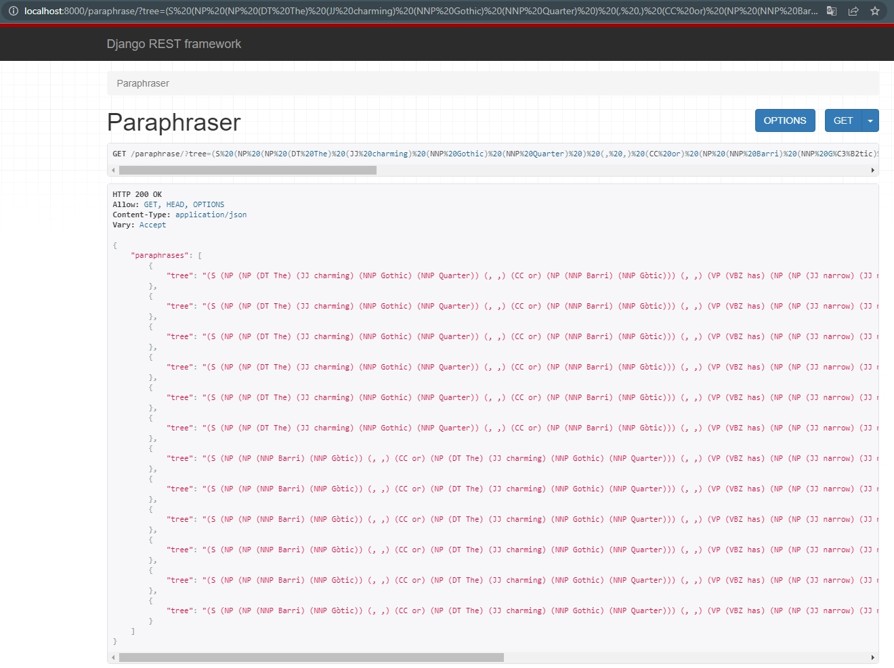
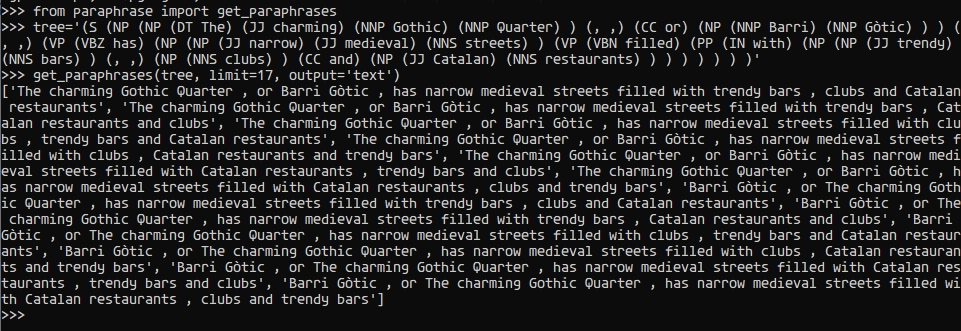
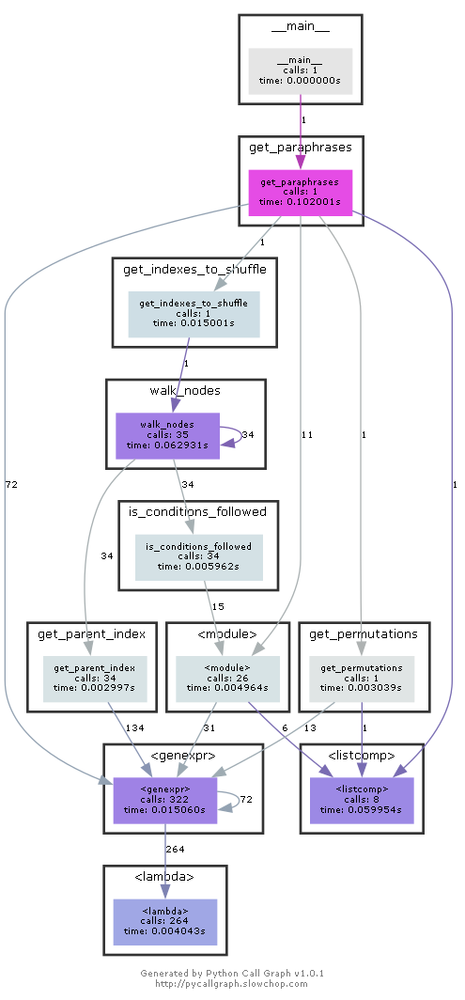

# Text generator
## demo
a bracketed tree string
```
(S (NP (NP (DT The) (JJ charming) (NNP Gothic) (NNP Quarter) ) (, ,) (CC or) (NP (NNP Barri) (NNP Gòtic) ) ) (, ,) (VP (VBZ has) (NP (NP (JJ narrow) (JJ medieval) (NNS streets) ) (VP (VBN filled) (PP (IN with) (NP (NP (JJ trendy) (NNS bars) ) (, ,) (NP (NNS clubs) ) (CC and) (NP (JJ Catalan) (NNS restaurants) ) ) ) ) ) ) )
```
result - 12 unique sentenses
```
The charming Gothic Quarter , or Barri Gòtic , has narrow medieval streets filled with trendy bars , clubs and Catalan restaurants
The charming Gothic Quarter , or Barri Gòtic , has narrow medieval streets filled with trendy bars , Catalan restaurants and clubs
The charming Gothic Quarter , or Barri Gòtic , has narrow medieval streets filled with clubs , trendy bars and Catalan restaurants
The charming Gothic Quarter , or Barri Gòtic , has narrow medieval streets filled with clubs , Catalan restaurants and trendy bars
The charming Gothic Quarter , or Barri Gòtic , has narrow medieval streets filled with Catalan restaurants , trendy bars and clubs
The charming Gothic Quarter , or Barri Gòtic , has narrow medieval streets filled with Catalan restaurants , clubs and trendy bars
Barri Gòtic , or The charming Gothic Quarter , has narrow medieval streets filled with trendy bars , clubs and Catalan restaurants
Barri Gòtic , or The charming Gothic Quarter , has narrow medieval streets filled with trendy bars , Catalan restaurants and clubs
Barri Gòtic , or The charming Gothic Quarter , has narrow medieval streets filled with clubs , trendy bars and Catalan restaurants
Barri Gòtic , or The charming Gothic Quarter , has narrow medieval streets filled with clubs , Catalan restaurants and trendy bars
Barri Gòtic , or The charming Gothic Quarter , has narrow medieval streets filled with Catalan restaurants , trendy bars and clubs
Barri Gòtic , or The charming Gothic Quarter , has narrow medieval streets filled with Catalan restaurants , clubs and trendy bars
```
##### api

##### cli

## run
backend
```
cd backend
pip install -r requirements.txt
python manage.py migrate
python manage.py runserver
```
frontend
```
not implemented, not required
```
## test
api
```
cd backend
python manage.py test
```
unit (doctest)
```
cd backend/paraphraser
python paraphrase.py -v
```
manual
```
localhost:8000/paraphrase?tree=(S (NP (NP (DT The) (JJ charming) (NNP Gothic) (NNP Quarter) ) (, ,) (CC or)
(NP (NNP Barri) (NNP Gòtic) ) ) (, ,) (VP (VBZ has) (NP (NP (JJ narrow) (JJ medieval) (NNS streets) ) (VP (VBN
filled) (PP (IN with) (NP (NP (JJ trendy) (NNS bars) ) (, ,) (NP (NNS clubs) ) (CC and) (NP (JJ Catalan) (NNS
restaurants) ) ) ) ) ) ) )&limit=20
```
selenium
```
not implemented, not required
```
## paraphraser library

call graph



usage

```
from paraphrase import get_paraphrases

tree = '(S (NP (NP (DT The) (JJ charming) (NNP Gothic) (NNP Quarter) ) (, ,) (CC or) (NP (NNP Barri) (NNP Gotic) ) ) )'
get_paraphrases(tree)
get_paraphrases(tree, limit=17)
get_paraphrases(tree, output='text')
```

## tools
```
doctest
django
django rest framework
nltk
python 3.8
selenium
```